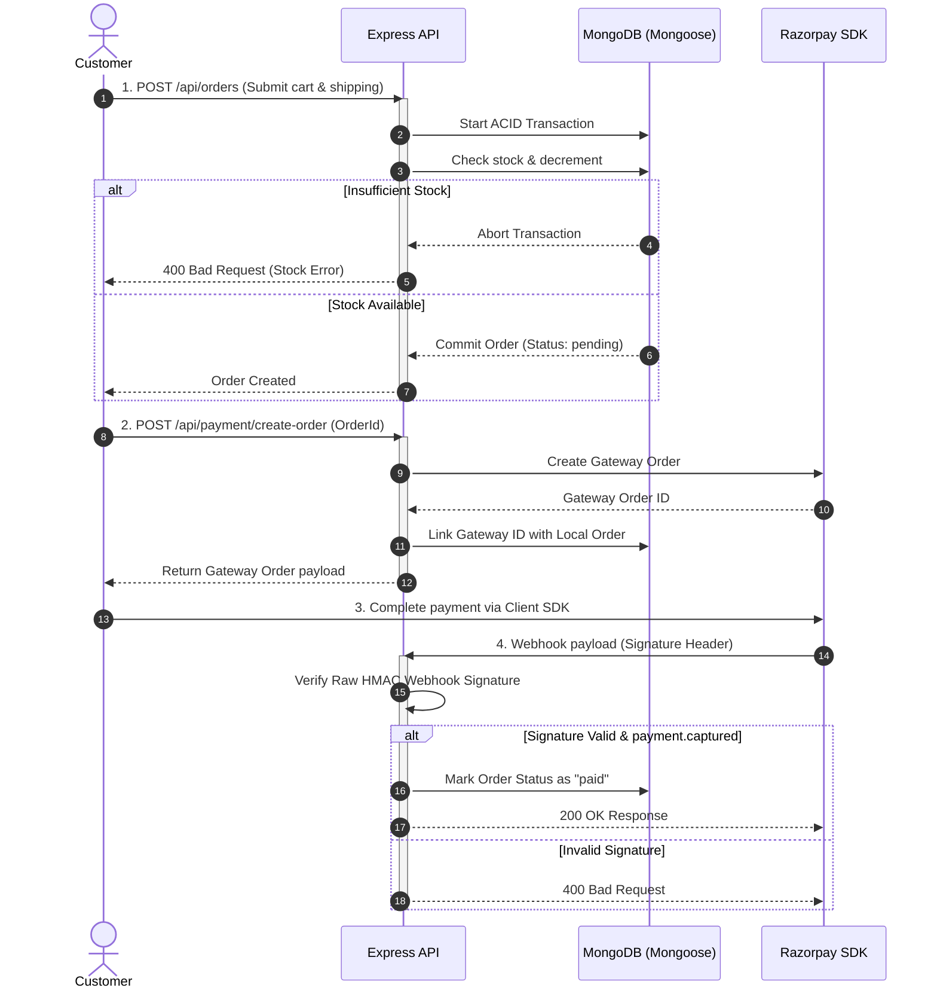

<div align="center">
  
  
  # ⚡ Ain Backend API
  
  ### Production-Grade E-Commerce Backend Engine
  
  *A robust, role-aware REST API built for modern digital commerce platforms.*

  [](https://nodejs.org/)
  [](https://expressjs.com/)
  [](https://www.mongodb.com/)
  [](https://jwt.io/)
  [](https://razorpay.com/)
  
</div>

---

## 📌 Overview

**Ain** is a production-style, role-based backend API for e-commerce applications. Designed with a clean MVC architecture, it handles crucial digital commerce workflows: secure authentication, catalog search/filtering/pagination, cart operations, checkout with atomic stock validation, Razorpay payment processing, and admin analytics.

---

## 📁 System Architecture

The following diagram illustrates the client-server request pipeline and data flow through the architecture:


<details>
<summary><b>🛠️ Directory & Module Architecture</b> (Click to expand)</summary>

```text
ain/
  ├── assets/                 # Brand assets & architecture diagrams
  ├── config/                 # Database connector & global configurations
  ├── controllers/            # Request handlers (processes inputs, interacts with models)
  ├── docs/                   # Full markdown API documentation
  ├── middleware/             # Route interceptors (auth, role filters, uploads, error boundaries)
  ├── models/                 # Mongoose schemas with validation and business constraints
  ├── routes/                 # Express route mappings
  ├── scripts/                # Utility scripts (syntax verification)
  └── uploads/                # Local storage for product images (served statically)
```
</details>

---

## 🧪 Checkout & Razorpay Payment Flow

This diagram outlines the transactional order creation and secure signature validation lifecycle:



---

## 🔐 Deep Dive: Core Features & Logic

Here is an explanation of the core workflows implemented in the codebase:

### 1. Atomic Order Processing (ACID Transactions)
To prevent overselling and "ghost orders" (where multiple customers attempt to purchase the last item simultaneously), order creation uses MongoDB sessions & transactions:
* **Concurrency Protection:** The server opens a transaction block, fetches the current stock of all cart items, checks availability, and decrements stock.
* **Failure Handling:** If any product does not have enough stock, the entire transaction is rolled back, restoring initial values. No partial order is saved.

### 2. Secure Webhook Validation
Razorpay payment confirmations are handled via webhooks. To secure this against falsified payloads:
* **Raw Body Buffer:** The express router captures the raw request payload before it is parsed into JSON.
* **HMAC Verification:** The server generates a SHA-256 HMAC digest of the raw payload using the secret `RAZORPAY_WEBHOOK_SECRET` and compares it to the incoming `x-razorpay-signature` header.

### 3. Aggregation-Based Admin Analytics
To display sales insights, the admin dashboard pulls aggregate data from MongoDB:
* **Daily Sales:** Groups orders by day and calculates cumulative revenue and average order values.
* **Top Selling Products:** Unwinds the order items array, groups by product identifier, matches product details, and sorts by quantity sold.

---

## 📡 API Directory (Summary)

Detailed response formats and parameter specs are available in the [docs/API.md](docs/API.md) document.

| Category | Method | Endpoint | Access | Key Payload / Query parameters |
| :--- | :--- | :--- | :--- | :--- |
| **Auth** | `POST` | `/api/auth/register` | Public | `name`, `username`, `email`, `password` |
| | `POST` | `/api/auth/login` | Public | `username`, `password` |
| | `POST` | `/api/auth/bootstrap-admin` | Secret | `bootstrapSecret` + User credentials |
| **Products** | `GET` | `/api/products` | Public | Query: `keyword`, `category`, `minPrice`, `maxPrice`, `page`, `limit` |
| | `GET` | `/api/products/:id` | Public | - |
| | `POST` | `/api/products` | Admin | Multipart: `name`, `price`, `description`, `category`, `stock`, `images` |
| | `PUT` | `/api/products/:id` | Admin | Modify product fields |
| | `DELETE` | `/api/products/:id` | Admin | - |
| **Cart** | `GET` | `/api/cart` | Customer | - |
| | `POST` | `/api/cart` | Customer | `productId`, `quantity` |
| | `PUT` | `/api/cart/:productId` | Customer | `quantity` |
| | `DELETE` | `/api/cart/:productId`| Customer | - |
| | `DELETE` | `/api/cart` | Customer | - |
| **Orders** | `POST` | `/api/orders` | Customer | `shippingAddress` (address, city, postalCode, country) |
| | `GET` | `/api/orders` | Customer | - |
| | `GET` | `/api/orders/:id` | Customer | - |
| **Payments** | `POST` | `/api/payment/create-order`| Customer | `orderId` |
| | `POST` | `/api/payment/webhook` | Razorpay | Webhook raw body + signature headers |
| **Analytics**| `GET` | `/api/analytics/summary` | Admin | Overall metrics (revenue, total orders, averages) |
| | `GET` | `/api/analytics/category`| Admin | Breakdown of revenue grouped by category |
| | `GET` | `/api/analytics/top-products`| Admin | List of top products sorted by quantities sold |
| | `GET` | `/api/analytics/daily` | Admin | Time-series data for daily revenue tracking |
| **System** | `GET` | `/health` | Public | Standard health check response |

---

## 📂 Installation & Configuration

<details>
<summary><b>1. Environment Settings (.env)</b></summary>

Create a `.env` file in the project root:
```env
PORT=5000
MONGO_URL=your_mongodb_connection_string
CORS_ORIGIN=http://localhost:3000
JWT_SECRET=your_jwt_secret
ADMIN_BOOTSTRAP_SECRET=one_time_admin_setup_secret
RAZORPAY_KEY_ID=your_razorpay_key_id
RAZORPAY_KEY_SECRET=your_razorpay_key_secret
RAZORPAY_WEBHOOK_SECRET=your_webhook_secret
```
</details>

<details>
<summary><b>2. Admin Bootstrapping</b></summary>

To initialize the database with your first administrator account, send this request:
```http
POST /api/auth/bootstrap-admin
Content-Type: application/json

{
  "name": "Super Admin",
  "username": "admin",
  "email": "admin@example.com",
  "password": "secure_password",
  "bootstrapSecret": "one_time_admin_setup_secret"
}
```
*Note: This is a one-time setup action. Once an admin account exists, this endpoint yields a 409 Conflict.*
</details>

<details>
<summary><b>3. Running the Server & Code Validation</b></summary>

```bash
# Install dependencies
npm install

# Start in development watch mode
npm run dev

# Start in standard production mode
npm start

# Run syntax check across JS codebase
npm run check
```
Runs a code health check with the [check-syntax.js](scripts/check-syntax.js) helper script.
</details>

---

## 🔒 Security & Reliability Features

* **ACID Transactions:** Inventory is updated safely inside database transactions; checkout failures trigger a clean rollback to prevent ghost orders.
* **Role-Based Guards:** Strict token verification middlewares isolate Customer checkout routes and Admin analytics routes.
* **HMAC Signature Checks:** Webhook requests from Razorpay are verified on the raw request buffer using SHA-256 signatures before updating payment states.
* **Centralized Error Boundary:** An global Express error handler catches all database, connection, and API validation issues, serving structured JSON responses.
