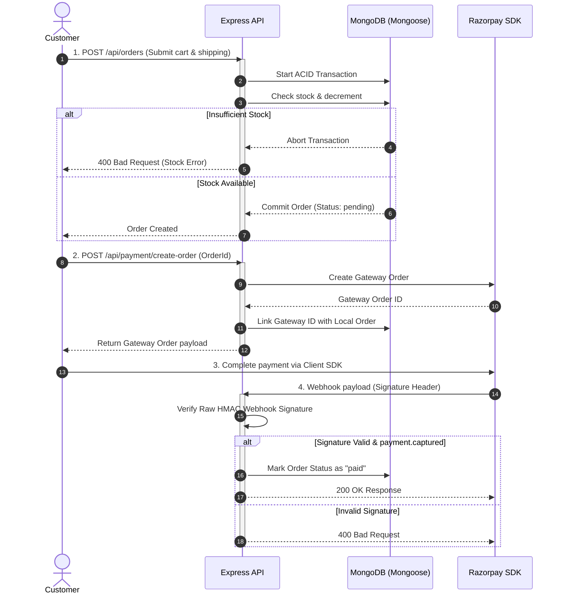

<div align="center">
  
  
  # ⚡ Ain Backend API
  
  ### Production-Grade E-Commerce Backend Engine
  
  *A robust, role-aware REST API built for modern digital commerce platforms.*

  [](https://nodejs.org/)
  [](https://expressjs.com/)
  [](https://www.mongodb.com/)
  [](https://jwt.io/)
  [](https://razorpay.com/)
  
</div>

---

## 📌 Overview

**Ain** is a production-style, role-based backend API for e-commerce applications. Designed with a clean MVC architecture, it handles crucial digital commerce workflows: secure authentication, catalog search/filtering/pagination, cart operations, checkout with atomic stock validation, Razorpay payment processing, and admin analytics.

---

## 📁 System Architecture

The following diagram illustrates the client-server request pipeline and data flow through the architecture:


### 🛠️ Tech Stack & Directory Structure
* **Runtime & Framework:** Node.js (ES Modules) + Express.js
* **Database & ODM:** MongoDB + Mongoose (ACID Transactions enabled)
* **Security:** JWT Authentication + bcryptjs Password Hashing
* **Third-Party Services:** Razorpay Payments + Multer File Uploads
* **File Structure:**
  * [server.js](file:///d:/Projects/4.%20E%20commerece/ain/server.js) — Application entry point
  * `controllers/` — Request handlers & business logic
  * `models/` — Database schemas (User, Product, Cart, Order)
  * `routes/` — Endpoint mapping
  * `middleware/` — Auth filters, image parser & error interceptor
  * `utils/` — Transaction helpers & validation utilities
  * [package.json](file:///d:/Projects/4.%20E%20commerece/ain/package.json) — Dependency & scripts manifest

---

## 🧪 Checkout & Razorpay Payment Flow

This diagram outlines the transactional order creation and secure signature validation lifecycle:



---

## 📡 API Directory (Summary)

Detailed response formats and parameter specs are available in the [API.md](file:///d:/Projects/4.%20E%20commerece/ain/docs/API.md) document.

| Category | Method | Endpoint | Access | Function |
| :--- | :--- | :--- | :--- | :--- |
| **Auth** | `POST` | `/api/auth/register` | Public | Register customer |
| | `POST` | `/api/auth/login` | Public | Standard login (all roles) |
| | `POST` | `/api/auth/bootstrap-admin` | Secret | One-time admin setup |
| **Products** | `GET` | `/api/products` | Public | Search, filter, paginate catalog |
| | `GET` | `/api/products/:id` | Public | Fetch product by ID |
| | `POST` | `/api/products` | Admin | Create product with Multer uploads |
| | `PUT` | `/api/products/:id` | Admin | Modify product fields |
| | `DELETE` | `/api/products/:id` | Admin | Remove product |
| **Cart** | `GET` | `/api/cart` | Customer | Fetch current customer's cart |
| | `POST` | `/api/cart` | Customer | Add/increment items |
| | `PUT` | `/api/cart/:productId` | Customer | Update item quantity |
| | `DELETE` | `/api/cart/:productId`| Customer | Remove item |
| | `DELETE` | `/api/cart` | Customer | Clear entire cart |
| **Orders** | `POST` | `/api/orders` | Customer | Checkout and place order |
| | `GET` | `/api/orders` | Customer | List owned orders |
| | `GET` | `/api/orders/:id` | Customer | Retrieve specific order detail |
| **Payments** | `POST` | `/api/payment/create-order`| Customer | Create Razorpay order |
| | `POST` | `/api/payment/webhook` | Razorpay | Verify signature & capture payment |
| **Analytics**| `GET` | `/api/analytics/summary` | Admin | Total revenue, count & averages |
| | `GET` | `/api/analytics/category`| Admin | Breakdown of sales by category |
| | `GET` | `/api/analytics/top-products`| Admin | Best selling product lists |
| | `GET` | `/api/analytics/daily` | Admin | Line chart data for daily metrics |
| **System** | `GET` | `/health` | Public | API health check status |

---

## 📂 Installation & Configuration

<details>
<summary><b>1. Environment Settings (.env)</b></summary>

Create a `.env` file in the project root:
```env
PORT=5000
MONGO_URL=your_mongodb_connection_string
CORS_ORIGIN=http://localhost:3000
JWT_SECRET=your_jwt_secret
ADMIN_BOOTSTRAP_SECRET=one_time_admin_setup_secret
RAZORPAY_KEY_ID=your_razorpay_key_id
RAZORPAY_KEY_SECRET=your_razorpay_key_secret
RAZORPAY_WEBHOOK_SECRET=your_webhook_secret
```
</details>

<details>
<summary><b>2. Admin Bootstrapping</b></summary>

To initialize the database with your first administrator account, send this request:
```http
POST /api/auth/bootstrap-admin
Content-Type: application/json

{
  "name": "Super Admin",
  "username": "admin",
  "email": "admin@example.com",
  "password": "secure_password",
  "bootstrapSecret": "one_time_admin_setup_secret"
}
```
*Note: This is a one-time setup action. Once an admin account exists, this endpoint yields a 409 Conflict.*
</details>

<details>
<summary><b>3. Running the Server & Code Validation</b></summary>

```bash
# Install dependencies
npm install

# Start in development watch mode
npm run dev

# Start in standard production mode
npm start

# Run syntax check across JS codebase
npm run check
```
Runs a code health check with the [check-syntax.js](file:///d:/Projects/4.%20E%20commerece/ain/scripts/check-syntax.js) helper script.
</details>

---

## 🔒 Security & Reliability Features

* **ACID Transactions:** Inventory is updated safely inside database transactions; checkout failures trigger a clean rollback to prevent ghost orders.
* **Role-Based Guards:** Strict token verification middlewares isolate Customer checkout routes and Admin analytics routes.
* **HMAC Signature Checks:** Webhook requests from Razorpay are verified on the raw request buffer using SHA-256 signatures before updating payment states.
* **Centralized Error Boundary:** An global Express error handler catches all database, connection, and API validation issues, serving structured JSON responses.
