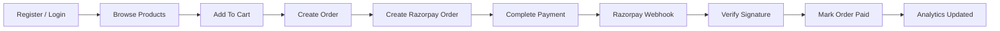

<div align="center">

# Ain

### Production-style E-Commerce Backend API

A secure, role-aware backend for modern commerce apps, built with Node.js, Express, MongoDB, JWT authentication, file uploads, Razorpay payments, verified webhooks, and analytics.

<br />

[](https://nodejs.org/)
[](https://expressjs.com/)
[](https://www.mongodb.com/)
[](https://jwt.io/)
[](https://razorpay.com/)

</div>

---

## Overview

**Ain** is a complete backend API for an e-commerce platform. It handles the core workflows needed by a real commerce application: user authentication, product catalog management, cart operations, order creation, stock updates, payment initialization, Razorpay webhook verification, and admin analytics.

The project follows a clean MVC-style structure and includes practical backend concerns such as role-based authorization, centralized error handling, request validation, file upload handling, static upload serving, health checks, and project-wide syntax verification.

---

## Highlights

| Area | What It Includes |
| --- | --- |
| Authentication | Register, login, JWT tokens, password hashing |
| Authorization | Customer/admin roles and protected admin APIs |
| Admin Setup | One-time admin bootstrap using a secret |
| Products | CRUD, image uploads, search, filtering, pagination |
| Cart | Add, update, remove, clear, and fetch cart items |
| Orders | Transaction-based order creation and stock reduction |
| Payments | Razorpay order creation and payment status handling |
| Webhooks | Raw-body Razorpay signature verification |
| Analytics | Revenue, category sales, top products, daily sales |
| Reliability | Centralized errors, health check, route fallback |
| Tooling | Full-project syntax checker via `npm run check` |

---

## Tech Stack

| Layer | Technology |
| --- | --- |
| Runtime | Node.js |
| Framework | Express.js |
| Database | MongoDB |
| ODM | Mongoose |
| Auth | JWT |
| Password Hashing | bcryptjs |
| Payments | Razorpay |
| Uploads | Multer |
| Config | dotenv |

---

## Project Structure

```text
ain/
  assets/                 Project assets
  controllers/            Request handlers and business logic
  docs/
    API.md                Detailed endpoint documentation
  middleware/             Auth, upload, and error middleware
  models/                 Mongoose schemas
  routes/                 Express route modules
  scripts/
    check-syntax.js       Project-wide syntax checker
  uploads/                Runtime product image uploads
  .env.example            Environment variable template
  package.json            Scripts and dependencies
  server.js               Application entry point
```

---

## Core Features

### Authentication and Roles

- Customer registration and login
- Secure password hashing
- JWT-based stateless sessions
- Role stored on users as `customer` or `admin`
- Admin-only product and analytics routes
- One-time admin bootstrap endpoint

### Product Catalog

- Public product listing
- Product detail endpoint
- Keyword search across name and description
- Category filtering
- Min/max price filtering
- Pagination with safe limits
- Admin-only create, update, and delete
- Multiple product image uploads
- Static serving for uploaded product images

### Cart and Orders

- Customer-specific cart
- Add product to cart
- Update item quantity
- Remove item from cart
- Clear cart
- Create order with shipping address
- Reduce product stock inside MongoDB transaction
- Prevent invalid quantities and missing order data

### Payments

- Create Razorpay payment order for a local order
- Store Razorpay order id in local order payment info
- Verify webhook signature using raw request body
- Mark orders as paid after successful Razorpay events

### Analytics

Admin-only analytics endpoints include:

- Total revenue
- Total paid orders
- Average order value
- Revenue by category
- Top-selling products
- Daily sales

---

## Getting Started

### 1. Clone and Install

```bash
npm install
```

### 2. Configure Environment

Create a `.env` file in the project root.

```env
PORT=5000
MONGO_URL=your_mongodb_connection_string
CORS_ORIGIN=http://localhost:3000
JWT_SECRET=your_jwt_secret
ADMIN_BOOTSTRAP_SECRET=one_time_admin_setup_secret
RAZORPAY_KEY_ID=your_razorpay_key_id
RAZORPAY_KEY_SECRET=your_razorpay_key_secret
RAZORPAY_WEBHOOK_SECRET=your_webhook_secret
```

You can also use `.env.example` as the template.

### 3. Run the Server

Development mode:

```bash
npm run dev
```

Normal mode:

```bash
npm start
```

The API runs on:

```text
http://localhost:5000
```

### 4. Check Project Syntax

```bash
npm run check
```

Expected output:

```text
Syntax check passed for 22 JavaScript files.
```

---

## Environment Variables

| Variable | Required | Description |
| --- | --- | --- |
| `PORT` | No | Server port. Defaults to `5000`. |
| `MONGO_URL` | Yes | MongoDB connection string. |
| `CORS_ORIGIN` | No | Allowed frontend origin. Use comma-separated values for multiple origins. |
| `JWT_SECRET` | Yes | Secret used to sign JWT tokens. |
| `ADMIN_BOOTSTRAP_SECRET` | For admin setup | Secret required to create the first admin user. |
| `RAZORPAY_KEY_ID` | For payments | Razorpay key id. |
| `RAZORPAY_KEY_SECRET` | For payments | Razorpay key secret. |
| `RAZORPAY_WEBHOOK_SECRET` | For webhooks | Secret used to verify Razorpay webhook signatures. |

---

## Admin Bootstrap

Before using admin-only APIs, create the first admin user.

```http
POST /api/auth/bootstrap-admin
```

Request body:

```json
{
  "name": "Admin User",
  "username": "admin",
  "email": "admin@example.com",
  "password": "secret123",
  "bootstrapSecret": "one_time_admin_setup_secret"
}
```

Important behavior:

- `bootstrapSecret` must match `ADMIN_BOOTSTRAP_SECRET`.
- The endpoint creates only the first admin.
- Once an admin exists, it returns a conflict response and refuses to create another admin.

---

## API Overview

Full request and response details are documented in [docs/API.md](docs/API.md).

### Auth

| Method | Endpoint | Access | Description |
| --- | --- | --- | --- |
| `POST` | `/api/auth/register` | Public | Register customer |
| `POST` | `/api/auth/login` | Public | Login customer/admin |
| `POST` | `/api/auth/bootstrap-admin` | Secret-protected | Create first admin |

### Products

| Method | Endpoint | Access | Description |
| --- | --- | --- | --- |
| `GET` | `/api/products` | Public | List products with search/filter/pagination |
| `GET` | `/api/products/:id` | Public | Get product by id |
| `POST` | `/api/products` | Admin | Create product with images |
| `PUT` | `/api/products/:id` | Admin | Update product |
| `DELETE` | `/api/products/:id` | Admin | Delete product |

### Cart

| Method | Endpoint | Access | Description |
| --- | --- | --- | --- |
| `GET` | `/api/cart` | Customer | Get current user's cart |
| `POST` | `/api/cart` | Customer | Add item to cart |
| `PUT` | `/api/cart/:productId` | Customer | Update item quantity |
| `DELETE` | `/api/cart/:productId` | Customer | Remove item |
| `DELETE` | `/api/cart` | Customer | Clear cart |

### Orders

| Method | Endpoint | Access | Description |
| --- | --- | --- | --- |
| `POST` | `/api/orders` | Customer | Create order |
| `GET` | `/api/orders` | Customer | Get current user's orders |
| `GET` | `/api/orders/:id` | Customer | Get one owned order |

### Payments

| Method | Endpoint | Access | Description |
| --- | --- | --- | --- |
| `POST` | `/api/payment/create-order` | Customer | Create Razorpay order |
| `POST` | `/api/payment/webhook` | Razorpay | Verify payment webhook |

### Analytics

| Method | Endpoint | Access | Description |
| --- | --- | --- | --- |
| `GET` | `/api/analytics/summary` | Admin | Sales summary |
| `GET` | `/api/analytics/category` | Admin | Revenue by category |
| `GET` | `/api/analytics/top-products` | Admin | Top-selling products |
| `GET` | `/api/analytics/daily` | Admin | Daily sales |

### System

| Method | Endpoint | Access | Description |
| --- | --- | --- | --- |
| `GET` | `/health` | Public | Health check |
| `GET` | `/` | Public | API running message |

---

## Example Product Query

```http
GET /api/products?keyword=shoe&category=men&minPrice=500&maxPrice=3000&page=1&limit=10
```

---

## Razorpay Webhook Setup

Configure Razorpay to send webhooks to:

```text
POST /api/payment/webhook
```

Use the same webhook secret in Razorpay and in `.env`:

```env
RAZORPAY_WEBHOOK_SECRET=your_webhook_secret
```

The webhook route is registered before `express.json()`, so the raw body is preserved for signature verification.

---

## Request Flow



---

## Security and Reliability

- Passwords are hashed before storage.
- JWT tokens include user id and role.
- Admin APIs are protected by role middleware.
- Webhook signatures are compared safely.
- JSON request size is limited.
- Basic security headers are set.
- Unknown routes return structured JSON.
- Errors are handled through centralized middleware.
- Product uploads are restricted to image MIME types.
- Cart and order quantities are validated.
- Order stock updates use MongoDB transactions.

---

## Verification

Run:

```bash
npm run check
```

This checks every JavaScript file in the project with `node --check`.

Current verified result:

```text
Syntax check passed for 22 JavaScript files.
```

---

## Project Status

This backend is complete for a portfolio, capstone, or frontend-integrated e-commerce project. It has the major systems expected from a real backend:

- Auth
- Role-based admin access
- Product catalog
- Cart
- Orders
- Payments
- Webhooks
- Uploads
- Analytics
- Documentation
- Verification tooling

Recommended additions before a real production launch:

- Automated integration tests
- Swagger or Postman collection
- Dockerfile
- CI workflow
- Rate limiting on auth routes
- Cloud image storage such as S3 or Cloudinary
- Deployment-specific logging and monitoring

---

## Resume Summary

Built a production-style e-commerce backend with authentication, role-based authorization, catalog management, cart and order workflows, Razorpay payment integration, verified webhooks, image uploads, and MongoDB aggregation-based analytics.
